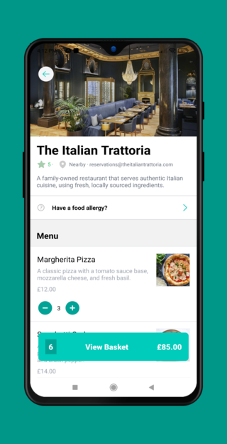

# Deliveroo - Clone

Este proyecto es una aplicación móvil creada con React Native y Expo utilizando TypeScript. Se trata de un clon de la plataforma Deliveroo, que ayuda a los usuarios a pedir comida a domicilio de restaurantes locales o cadenas internacionales cercanas. El backend del proyecto se implementó con Sanity, mientras que para los estilos se usó Tailwind. La aplicación está en inglés y ofrece las mismas funcionalidades principales que la plataforma Deliveroo.

## Tecnologías principales
-  React Native
-  Expo  
-  TypeScript  
-  Sanity  
-  Tailwind  

## Capturas de pantalla
A continuación se muestran algunas capturas de pantalla de la aplicación en un dispositivo móvil.
  
  
  
  
  

## Créditos
Este proyecto se creó a partir de un video tutorial del canal "Sonny Sangha" en YouTube. El enlace al video tutorial es https://www.youtube.com/watch?v=taPz40VmyzQ&list=PLSvtEtsyp827IO6bk6BTO-vXDK3RIV32H.

## Comparación entre el proyecto y el video tutorial
A diferencia del proyecto en el video tutorial, en este proyecto se utilizó TypeScript en lugar de JavaScript. Además, se utilizó Sanity como backend en lugar de Firebase.

## Enlace
Para ver la aplicación, puede escanear el siguiente código QR con la aplicación Expo Go:

